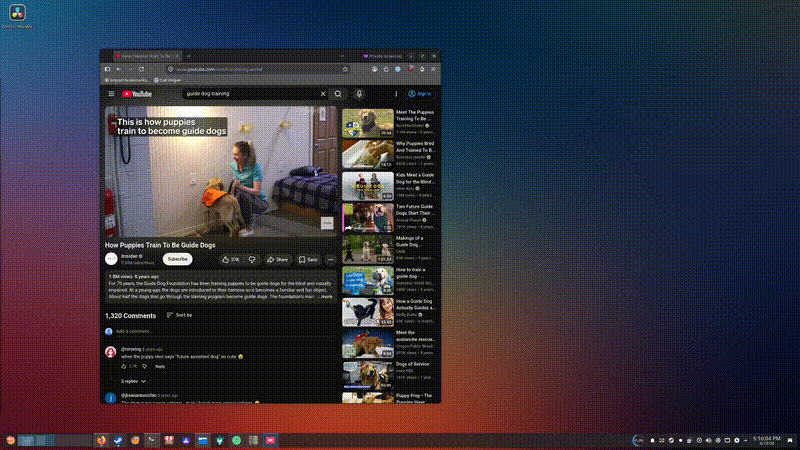

# Just Right

[](https://ko-fi.com/vastworks)



A Sizer-style window resizer for **KDE Plasma on Wayland**, with **beta support
for X11 desktops** like Linux Mint / Cinnamon. (Project folder is `window-sizer/`;
the user-facing name is "Just Right".) Resize the active window to exact dimensions
from a system-tray menu or a keyboard shortcut.

On Wayland, ordinary apps can't move or resize other apps' windows; only the
compositor can. So on KDE the actual resizing is done by a tiny **KWin script**,
and a **PyQt6 tray app** drives it over DBus. On X11 the same tray drives a
`wmctrl`-based backend directly. The tray auto-detects your desktop and picks
the right backend at launch.

> **See [CHANGELOG.md](CHANGELOG.md) for what's new in each release.**

## What it does

- **Tray menu of preset sizes.** Click a preset → the currently active window
  snaps to that size. Each preset can optionally re-center the window on its
  current monitor.
- **Keyboard shortcuts (optional).** Every preset is also a KDE global action.
  Open *System Settings → Shortcuts*, search **"Window Sizer"**, and bind keys.
- **Editable presets.** Add / edit / delete sizes in a small GUI.
- **Size popup.** A size indicator appears whenever a window is resized. On KDE
  this uses the Plasma OSD; on X11 it is a floating, outlined readout that
  follows the cursor while you drag.
- **Runs on KDE and X11.** One tray app; it auto-detects the desktop and uses
  the KWin backend on Plasma or the `wmctrl` backend on X11 (Mint / Cinnamon,
  beta).

## Install

```bash
cd window-sizer
bash install.sh
```

The installer:
- installs PyQt6 for the current user if it isn't already available,
- writes default presets and loads the KWin script,
- adds an autostart entry (tray starts at login) and a menu launcher for the editor.

Start the tray immediately, without logging out:

```bash
setsid python3 sizer_tray.py >/dev/null 2>&1 &
```

### X11 desktops (Mint / Cinnamon, beta)

On X11 the resizing is done with `wmctrl`, and the live size popup uses
`python3-xlib`. Install those plus PyQt6:

```bash
sudo apt install wmctrl xdotool python3-xlib python3-pyqt6
python3 sizer_tray.py
```

The tray detects X11 automatically and uses the `wmctrl` backend. Presets,
centering, the "Add current window size" capture, and the live drag popup all
work. See **Notes / limits** for what is KDE-only.

## Files

| File | Purpose |
|------|---------|
| `sizer_engine.py` | Shared presets file plus the KDE/KWin backend: generates the KWin script, loads it, triggers presets over DBus |
| `sizer_backend.py` | Picks a backend at launch (KWin on Plasma, `wmctrl` on X11) behind one interface |
| `sizer_overlay_x11.py` | X11-only live drag-dimensions popup (event-driven via python-xlib) |
| `sizer_tray.py` | System-tray app: the menu of presets |
| `sizer_editor.py` | PyQt6 dialog to add/edit/delete presets (also runs standalone) |
| `install.sh` | One-shot setup: deps, autostart, launcher |

## Config

- Presets: `~/.config/window-sizer/presets.json`
- Generated KWin script: `~/.config/window-sizer/window-sizer.js`

Each preset is `{ "name", "width", "height", "position", "identifier" }`, where
`position` is `"keep"` or `"center"`. The `identifier` is stable across renames
so any keyboard shortcut you assign stays bound.

## How it works

1. `sizer_engine.generate_script()` bakes the preset list into a KWin JavaScript
   file. For each preset it calls `registerShortcut()`, creating a named action
   that sets the active window's `frameGeometry`.
2. `reload_kwin_script()` loads that file into KWin via
   `org.kde.KWin /Scripting loadScript`.
3. The tray triggers a preset by calling
   `org.kde.kglobalaccel … invokeShortcut <action>`. The same action is what a
   keyboard shortcut would fire.

Sizes apply to the **window frame** (title bar + borders included), matching the
original Windows Sizer. Centering uses the available area of the window's current
monitor, so it works correctly across multiple displays.

## Notes / limits

- A window that declares itself non-resizable is left alone.
- If you change presets, the tray reloads automatically. If you edit
  `presets.json` by hand, pick **Reload backend** from the tray menu.

### X11 backend (beta)

- **No built-in global shortcuts.** KDE registers each preset as a global
  action; on X11 there is no equivalent yet. Bind a `wmctrl` command to a key in
  *Cinnamon Settings, Keyboard, Shortcuts* if you want hotkeys.
- **Live popup needs `python3-xlib`.** Without it the tray still works, just
  with no drag readout.
- **Reparenting window managers.** The live popup keys off the active window,
  which assumes client-side decorations (true on Cinnamon). On window managers
  with server-side frames the drag readout may not appear; presets still work.
- The KWin/Wayland backend exists because on Wayland `wmctrl`/`xdotool` cannot
  see or move native windows; only the compositor can.
